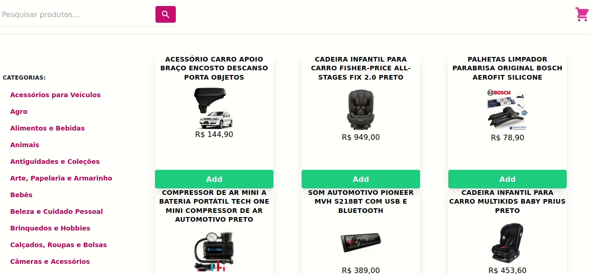

# [Front-End Online Store](https://frontend-online-store-sigma.vercel.app/)

Projeto feito em grupo durante o curso da [Trybe](https://www.betrybe.com/) com o objetivo de treinar as metodologias ágeis com DM's e Kanbam, além de utilizarmos React e Redux para a construção e gerenciamento de estado.

## 🔧 Funçoes

- Rota principal `/` com uma barra de pesquisa para pesquisar por nome ou categoria de produto.
- Rota `/cart` para o acesso aos produtos adicionados ao carrinho de compras.
- 
- Listagem de produtos por categoria
- Tela de Loading
- Tela de detalhes do produto clicado.

## ⭐ Habilidades

- Utilizar o Trello para organização em grupo.
- Utilizar o consumo de API.
- Utilizar Redux para gerenciamento de estado global.
- Utilizar o framework Tailwind CSS para realizar estilizações.

## 💻 Como iniciar

1. Faça o clone do projeto
2. Instale as dependências
```shell
npm install
```
3. Inicialize a aplicação
```shell
npm start
```

## Feito Com:
[](https://trello.com/)
[](https://code.visualstudio.com/)
[](https://developer.mozilla.org/pt-BR/docs/Web/React)
[](https://redux.js.org/)
[](https://developer.mozilla.org/pt-BR/docs/Web/JavaScript)
[](https://developer.mozilla.org/pt-BR/docs/Web/CSS)


## 🤝 Desenvolvedores

Agradecemos às seguintes pessoas que contribuíram para este projeto:

<table>
  <tr>
    <td align="center">
      <a href="https://github.com/matheuslrd">
        <br>
        <sub>
          <b>Matheus Laurindo</b>
        </sub>
      </a>
    </td>
    <td align="center">
      <a href="https://github.com/rafaelveigasts">
        <br>
        <sub>
          <b>Rafael Veiga</b>
        </sub>
      </a>
    </td>
    <td align="center">
      <a href="https://github.com/WeltonThomasFerreira">
        <br>
        <sub>
          <b>Thomas Ferreira</b>
        </sub>
      </a>
    </td>
    <td align="center">
      <a href="https://github.com/thales-bpl">
        <br>
        <sub>
          <b>Thales Lima</b>
        </sub>
      </a>
    </td>
  </tr>
</table>


### Contato

[](https://www.linkedin.com/in/matheuslrd/)


<p align="center">Copyright © 2021 Matheus Laurindo</p>
